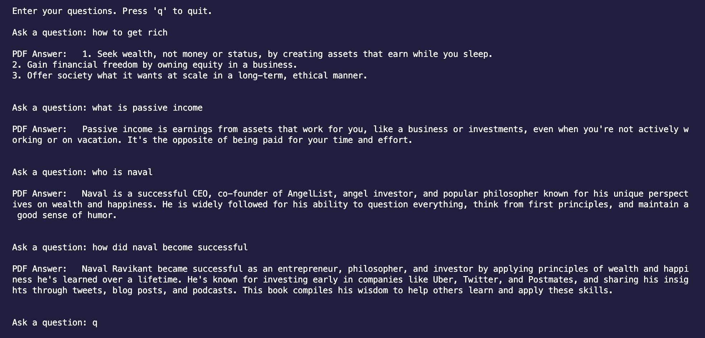

# AI-Powered PDF Chat Application

Explore the AI-Powered PDF Chat App for efficient interaction with PDF content using artificial intelligence.

## Getting Started

1. **Clone the Repository**: `git clone https://github.com/shaheem-voicenotes/chat-with-pdf`
2. **Add env variables**: copy `.env.example` content to a file named `.env` and add your env values
3. **Add your PDF file**: Add the PDF file that you want to chat with in the project root and rename it to `book.pdf`
4. **Install Dependancies**: Run the following command to install dependancies (You'll need to have pipenv to follow this guide, [install pipenv](https://pipenv.pypa.io/en/latest/installation.html) in your machine if not already present)
```bash
pipenv install
```
5. **Embedd the book**: run the following command to emded the book 
```bash
pipenv run python3 embed.py
```
6. **Run the chat**: run the following command to run the chat
```bash
pipenv run python3 chat.py
```

## Demo


